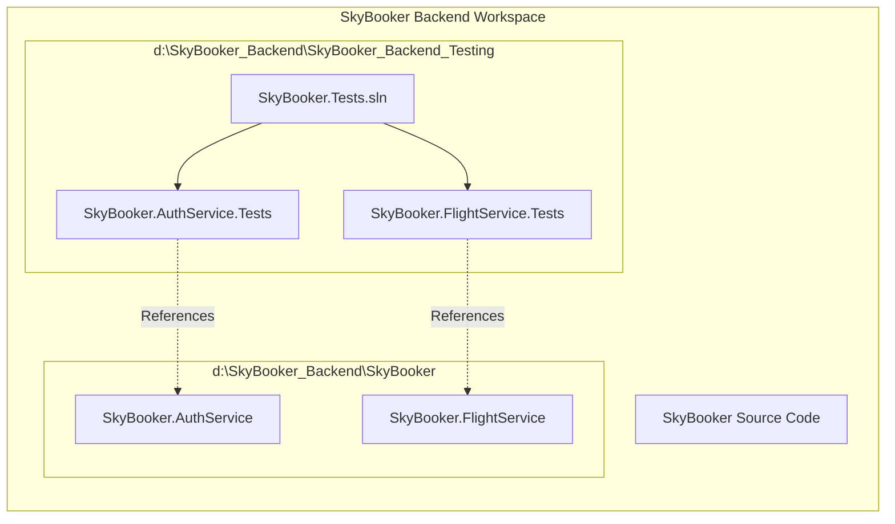
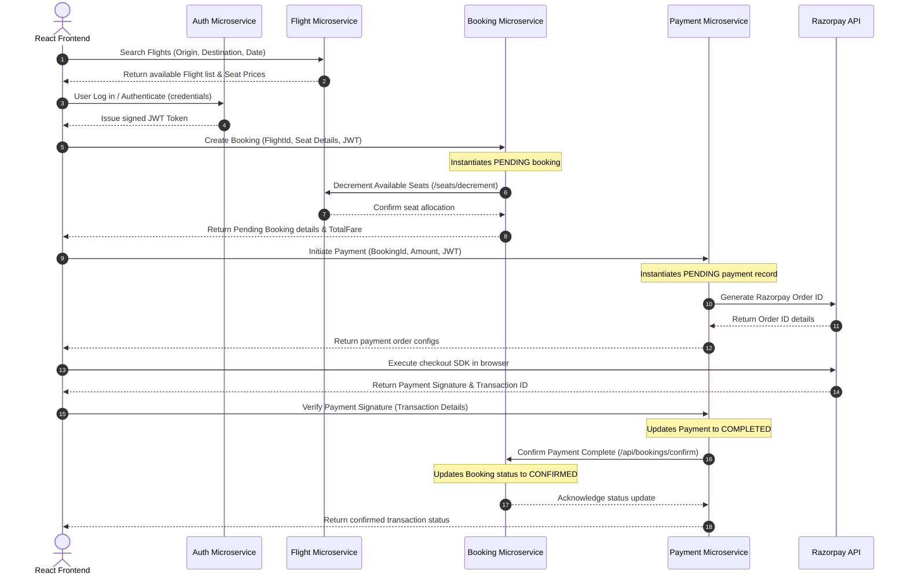
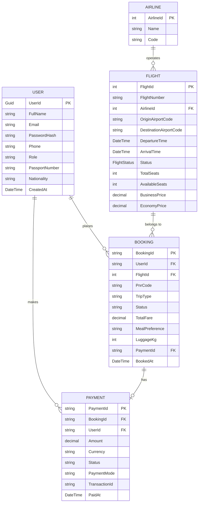
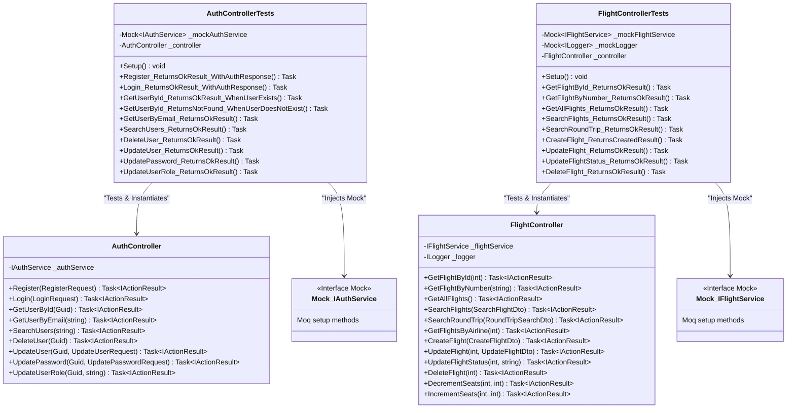

# SkyBooker Backend ✈

Welcome to the **SkyBooker Backend** codebase! This repository hosts the microservices architecture powering the SkyBooker flight booking platform.

---

## 🏗 System Architecture & Testing Directory Structure

To keep production builds lean and clean, the testing configurations, mocks, and test assertions are fully decoupled from production directories and isolated within `SkyBooker_Backend_Testing`.



---

## 🔄 Service Communication Flow Diagram

The sequence diagram below illustrates the end-to-end service communication during the user transaction lifecycle (Searching, Booking, and Payment Processing).



---

## 🗄 Database Entity-Relationship (ER) Diagram

Each microservice manages its own isolated database instance. Below is the conceptual entity-relationship (ER) mapping highlighting logical references across services.



---

## 🧪 Backend Unit Testing

We implement rigorous unit testing using **NUnit**, **Moq** for service dependency mocking, and **Microsoft.EntityFrameworkCore.InMemory** for database isolation.

### UML Class & Interaction Diagram

The diagram below shows how the C# API Controllers, their mocked service interfaces, and the test suites interact.



---

## 🏃 How to Run Backend Unit Tests

You can run the full suite of **33 unit tests** (17 in FlightService, 16 in AuthService) with a single command.

### Prerequisites
Make sure you have the [.NET SDK](https://dotnet.microsoft.com/download) installed on your system.

### Command Execution
1. Navigate into the testing folder:
   ```bash
   cd SkyBooker_Backend_Testing
   ```
2. Execute the test command:
   ```bash
   dotnet test
   ```

You will see output indicating that all 33 tests successfully compile and pass:
```shell
Passed!  - Failed:     0, Passed:    16, Skipped:     0, Total:    16 - SkyBooker.AuthService.Tests.dll
Passed!  - Failed:     0, Passed:    17, Skipped:     0, Total:    17 - SkyBooker.FlightService.Tests.dll
```